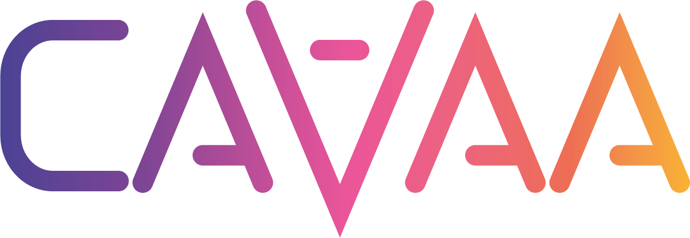

# CAVAA Repository

### Introduction
Welcome to the CAVAA repository. This project centers on developing a Counterfactual Assessment and Valuation for Awareness Architecture (CAVAA), aiming to advance AI awareness through integrated cognitive architectures. Here, you'll find the code and resources for building and experimenting with CAVAA's innovative AI systems.

For more invormation visit [CAVAA official webpage](https://cavaa.eu/)

